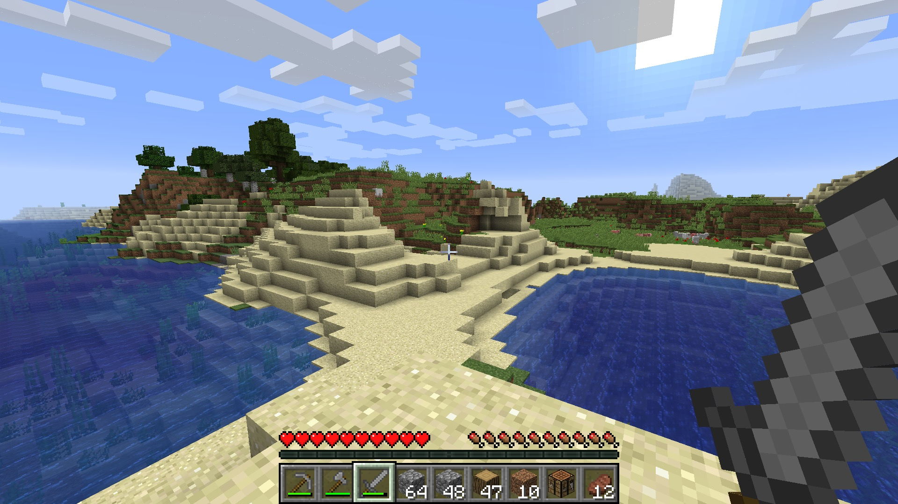
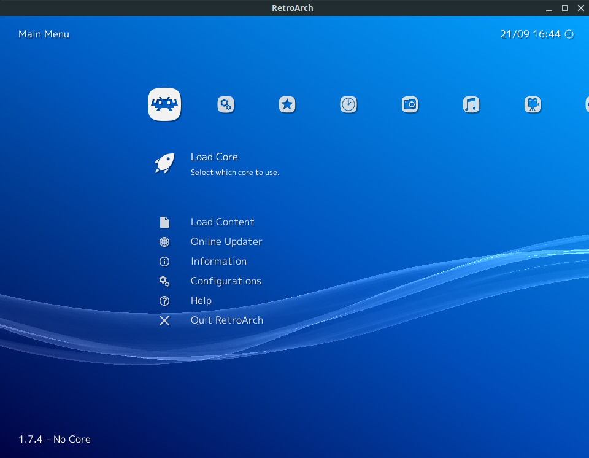

# Gaming

## Heroes of Newerth

First, install the latest version of HoN by downloading it and running "HoNClient.sh".

Assuming that you install to ~/HoN (default), you only need to run two commands:

``` bash
sudo eopkg it gconf libgcrypt11 libglu
```

That installs all of the dependencies that HoN needs.

``` bash
rm ~/HoN/libs-x86_64/{libcurl.so.4,libfreetype.so.6,libgcc_s.so.1,libgcrypt.so.11,libspeexdsp.so.1,libspeex.so.1,libstdc++.so.6,libudev.so.0}
```

This removes all the libraries that conflict with the ones in Solus.


## Lutris

Lutris is currently available via the Solus repository, as the `lutris` package.

### About

Lutris is an open gaming platform for Linux. It helps you install and manage your games in a unified interface. Their goal is to support every game which runs on Linux, from native to Windows games (via Wine) to emulators and browser games. The desktop application and the website are libre software, contributions are welcome!

For more information you can visit their website at [lutris.net](https://lutris.net). You can also see their list of games [here](https://lutris.net/games/).

## Minecraft

[Minecraft](https://minecraft.net) is a sandbox independent video game originally created by Swedish programmer Markus "Notch" Persson and later developed and published by the Swedish company Mojang.



### Installation

Install dependencies and download Minecraft:

``` bash
sudo eopkg it gconf binutils
wget https://launcher.mojang.com/download/Minecraft.deb
```

Extract files and remove old archive:

``` bash
sudo ar xf Minecraft.deb
sudo tar xf data.tar.xz -C /
sudo rm control.tar.xz data.tar.xz debian-binary Minecraft.deb
```

Integrate the installed files into your system:

``` bash
sudo usysconf run -f
```

## Retroarch

Retroarch is a frontend for emulators, game engines and media players. It has all you need to run classic games through its polished graphical interface.



### Installing the assets

The assets are not packaged with Retroarch itself and have to be downloaded from inside the program. This can easily be done by going into the Online Updater from the Main Menu and selecting "Update Assets".


## Steam

Steam is currently available via the Solus repository, as the `steam` package.

### NVIDIA

For systems running NVIDIA graphics hardware, you will need to install the corresponding 32bit video driver for your card, listed below:

- Current Gen: `nvidia-glx-driver-32bit`
- 390: `nvidia-390-glx-driver-32bit`
